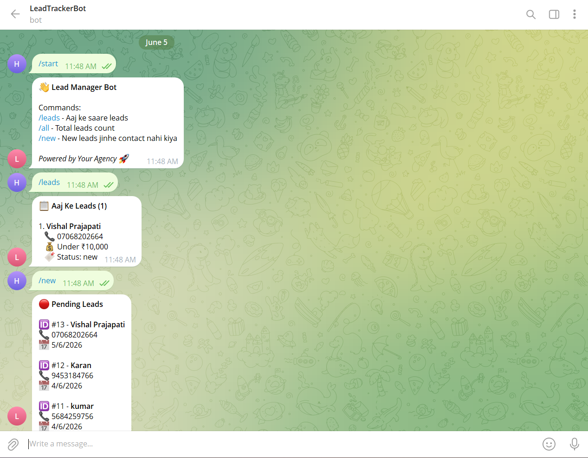

# 🤖 LeadTrackerBot — Telegram Lead Management System

A real-time lead management bot for Instagram Agencies. Whenever a customer fills out the landing form, the agency owner gets an **instant Telegram notification** with full lead details — and can manage all leads directly from Telegram using simple commands.

## 🚀 Live Demo

- **Landing Form:** [https://lead-landing-form.onrender.com/](https://lead-landing-form.onrender.com/)
- **Bot:** Search `@LeadTrackerBot` on Telegram

---

## 📸 Preview

> Bot in action — real-time lead notifications and command-based management



---

## ⚙️ How It Works

1. Customer visits the landing page and fills out the enquiry form
2. Form data is sent to the Node.js + Express backend
3. Lead is stored in PostgreSQL via Supabase
4. Bot instantly sends a formatted notification to the agency owner on Telegram
5. Owner uses bot commands to view and manage all leads

---

## 💬 Bot Commands

| Command | Description |
|---------|-------------|
| `/start` | Initialize bot and view available commands |
| `/leads` | Fetch today's leads with contact details |
| `/all` | Show total lead count across all time |
| `/new` | List pending leads not yet contacted |

---

## 🛠️ Tech Stack

| Layer | Technology |
|-------|------------|
| Backend | Node.js, Express.js |
| Database | PostgreSQL (via Supabase) |
| Bot | Telegram Bot API (`node-telegram-bot-api`) |
| Frontend | HTML, CSS (Landing Form) |
| Hosting | Render.com |

---

## 📁 Project Structure

```
Telegram-Bot/
├── bot.js          # Main bot logic and command handlers
├── server.js       # Express server for form submissions
├── db.js           # PostgreSQL / Supabase connection
├── .env.example    # Environment variable template
└── package.json
```

---

## 🔧 Setup & Installation

### 1. Clone the repository

```bash
git clone https://github.com/Hemchand44/Telegram-Bot.git
cd Telegram-Bot
```

### 2. Install dependencies

```bash
npm install
```

### 3. Configure environment variables

Create a `.env` file in the root directory:

```env
TELEGRAM_TOKEN=your_telegram_bot_token
CHAT_ID=your_telegram_chat_id
PORT=3000
DATABASE_URL=your_supabase_postgresql_url
NODE_ENV=development
```

### 4. Run the bot

```bash
node server.js
```

---

## 🌟 Key Features

- ✅ Real-time lead notifications — zero delay from form submission
- ✅ Persistent storage with PostgreSQL (Supabase) — no data loss
- ✅ Pending lead tracking — know exactly who hasn't been contacted
- ✅ Clean formatted messages with name, phone, budget, date & status
- ✅ Live deployed on Render — accessible 24/7
- ✅ Modular and scalable codebase

---

## 👨‍💻 Author

**Hemchand Prajapati**
- GitHub: [@Hemchand44](https://github.com/Hemchand44)
- LinkedIn: [hemchand-prajapati70](https://www.linkedin.com/in/hemchand-prajapati70/)
- Email: prajapatihemchand3@gmail.com
